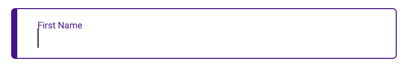
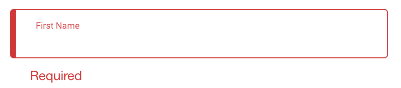

# floatLabelInput组件🐂
### ✌️组件样式
- 默认状态

- 激活状态

- 错误状态


### 👽使用方法
（可参考Contact.vue文件）
1. `import FloatLabelInput from './floatLabelInput'`(floatLabelInput.vue的**相对路径**)
2. 组件注册 
    ```
    components:{
    FloatLabelInput,
    }
    ```
3. 
```
<FloatLabelInput 
v-model="formVal.firName" :label="'First Name'" 
:formatInfo='{errorText:"Required",pattern:/\S/}'/>
```
    
    
    
    
### 🏷️可实现功能
（可参考Contact.vue文件）
- **基本输入框功能**，默认状态下的label字样，**v-model**数据双向绑定
  通过`label`属性传入label文本，`label|String`数据类型为String
- **失去焦点**时,根据正则校验结果,判断是否展示错误提示
  `:formatInfo='{errorText:"Required",pattern:/\S/}'`   

    formatInfo | errorText | pattern
    ----|------|----
    Object | String  | --
    -- | 错误文本  | 正则规则

- 获得焦点时，自动写入**前缀**
  通过`prefix`属性传入前缀文本，`prefix|String`数据类型为String
- 限制最大字数
  通过`maxLength`属性传入限制数字，`maxLength|Number`数据类型为Number

>⚠️本人根据contact页面要求，抽离出floatLabelInput组件，供大家使用或参考。
如果决定使用此组件，请先名确**需求**，判断该组件是否能满足，请谨慎使用，且勿轻易更改导致使用该组件其他页面出现问题。欢迎👏提供**建议**，共同完善该组件。 
*作者：党伟佳*   
  