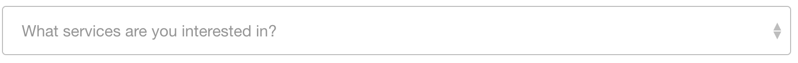
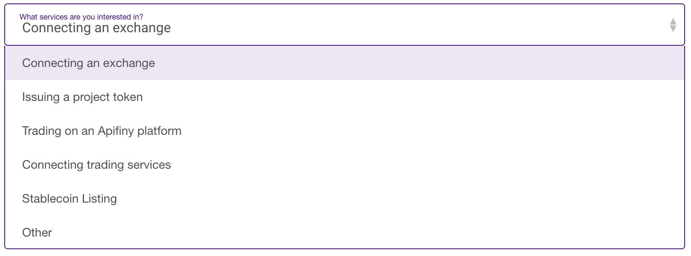
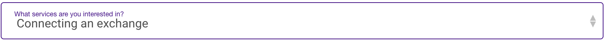

# select组件🐱
### 😁组件样式
- 默认状态

- 选择状态

- 激活状态


### 💧使用方法
（可参考Contact.vue文件）
1. `import Select from './select'`(select.vue的**相对路径**)
2. 组件注册
   ```
   components:{
    Select,
    }
    ```
3. 
    ```
    <Select 
     :selectTitle="whySelectTitle" 
     :selectOptions="whySelectOptions" 
     :currentOption="why" 
     v-model='why'/>

    ```
### 👂可实现的功能
(可参考Contact.vue文件)

- 下拉选框的**基本功能**，v-model实现双向数据绑定

    selectTitle | selectOptions | currentOption
    ----|------|----
    String | Array  | String
    标题 | 选项数据  | 默认选项
    
>⚠️本人根据contact页面要求，抽离出select组件，供大家使用或参考。
如果决定使用此组件，请先名确**需求**，判断该组件是否能满足，请谨慎使用，且勿轻易更改导致使用该组件其他页面出现问题。欢迎👏提供**建议**，共同完善该组件。
*作者：党伟佳*   
