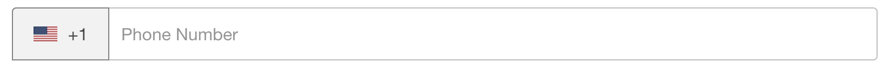
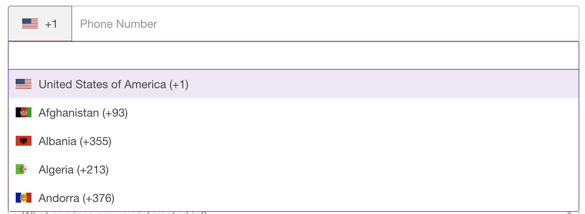
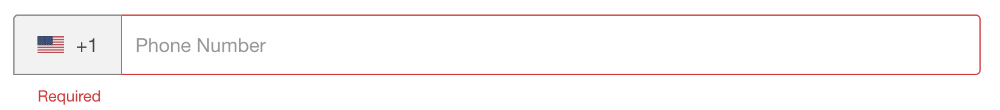

# selectAndInput组件🐑
### ✈️组件样式
- 默认状态

- 激活状态

- 错误状态


### 🤖️使用方法
（可参考Contact.vue文件）
1. `import SelectAndInput from './selectAndInput'`(selectAndInput.vue的**相对路径**)
2. 组件注册
   ```
   components:{
    SelectAndInput,
    }
    ```
3. 
    ```
    <SelectAndInput :optionData='cityDate' 
    :currentItem='cityDate[0]' v-model='formVal.phone'/>
    ```
    
### 😊可实现的功能
(可参考Contact.vue文件，根据需求，该组件尚未进行完全抽离，有待完善，仅供参考)
- 带下拉选项的输入框**基本功能**，v-model双向数据绑定

    optionData | currentItem 
    ----|-----
    String | Object
    下拉选项数据 | 默认选项  
    *currentItem 含image和code属性
    
- **搜索**功能，按照选项中是否含有输入内容进行筛选，忽略大小写
- 输入框**必填**，否则提示Required

>⚠️本人根据contact页面要求，抽离出selectAndInput组件，供大家使用或参考。
如果决定使用此组件，请先名确**需求**，判断该组件是否能满足，请谨慎使用，且勿轻易更改导致使用该组件其他页面出现问题。欢迎👏提供**建议**，共同完善该组件。    
*作者：党伟佳*  